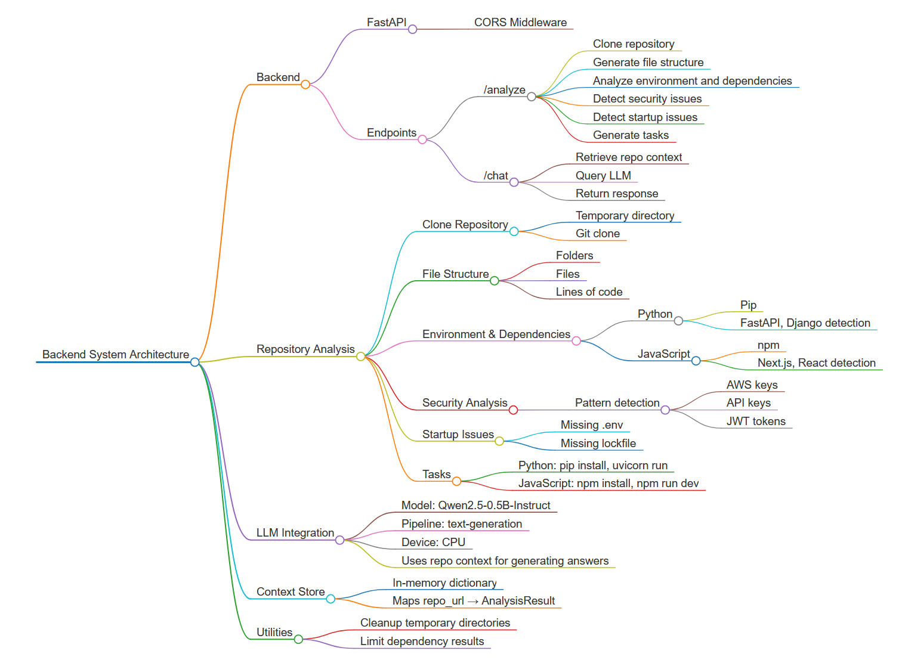

# Repository Analysis and AI Assistant Platform

This project provides an end-to-end system for analyzing code repositories, detecting security and startup issues, and enabling interactive queries through a language model. It is designed to assist developers, auditors, and DevOps teams in understanding, verifying, and interacting with codebases efficiently.

## Overview

The platform offers:

- **Repository Cloning and Analysis:** Automatically clone a repository and generate a detailed project overview, including environment, dependencies, file structure, and recommended startup tasks.
- **Security and Startup Checks:** Detect high-risk issues such as hardcoded API keys, missing environment files, and missing lock files.
- **AI-Powered Chat Interface:** Query repository-specific questions interactively using a pre-trained causal language model.
- **Temporary Repository Handling:** Safe cloning and automatic cleanup of repositories to maintain security and resource efficiency.

## Architecture

1. **FastAPI Backend:** Handles API requests for repository analysis and chat interactions.
2. **Language Model Integration:** Uses Transformers and PyTorch to run a causal language model for contextual queries.
3. **Repository Context Store:** In-memory store (`REPO_CONTEXT_STORE`) for tracking analyzed repositories and enabling context-aware chat.
4. **Analysis Modules:**  
   - **Environment and Dependency Detection:** Identifies language, framework, and package dependencies.  
   - **File Structure Extraction:** Generates a hierarchical view of all files and directories.  
   - **Security Scanner:** Detects sensitive keys, tokens, and other potential leaks.  
   - **Startup Issue Detection:** Checks for missing configuration files and setup issues.  
   - **Task Generator:** Suggests commands to install dependencies and run the project.

## Installation

1. Clone this repository.
2. Install dependencies:

```bash
pip install -r requirements.txt
````

3. Run the backend server:

```bash
uvicorn app:app --reload
```

## API Endpoints

### `/analyze` – Repository Analysis

**POST** request to clone and analyze a repository.

**Request:**

```json
{
  "repo_url": "https://github.com/user/repo.git"
}
```

**Response:**

Returns an `AnalysisResult` including:

* `environment`: Programming language, framework, and build system.
* `dependencies`: List of packages with versions.
* `structure`: Project file hierarchy.
* `tasks`: Recommended startup tasks.
* `security`: High-risk security issues.
* `startup_issues`: Potential startup problems.

### `/chat` – AI-Powered Chat

**POST** request to interact with the repository context using a language model.

**Request:**

```json
{
  "repo_id": "https://github.com/user/repo.git",
  "message": "List all high severity security issues",
  "history": []
}
```

**Response:**

```json
{
  "response": "The repository contains 2 high severity security issues in config.py and settings.py."
}
```

## Folder Structure

```
project/
├─ app.py                  # Main backend FastAPI server
├─ requirements.txt        # Python dependencies
├─ README.md               # Project documentation
└─ utils/                  # Analysis helper modules (optional)
```

## Security and Safety

* All cloned repositories are stored temporarily and deleted after processing.
* Security analysis scans for sensitive keys and tokens.
* Care should be taken when exposing the AI chat endpoint to untrusted users.

## Extensibility

* Supports adding custom language models.
* Modular analysis allows new security, dependency, and environment checks.
* Can be extended for CI/CD pipelines, automated code reviews, or developer tooling.

## License

 MIT License
